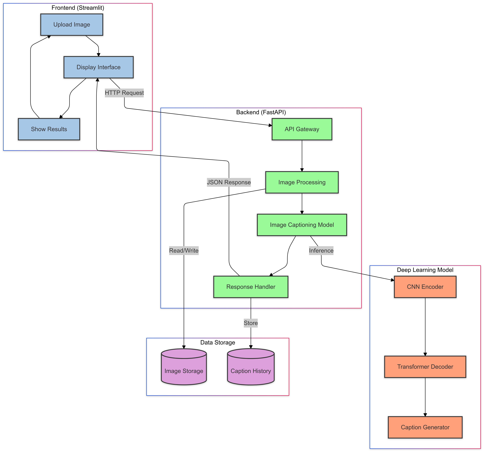
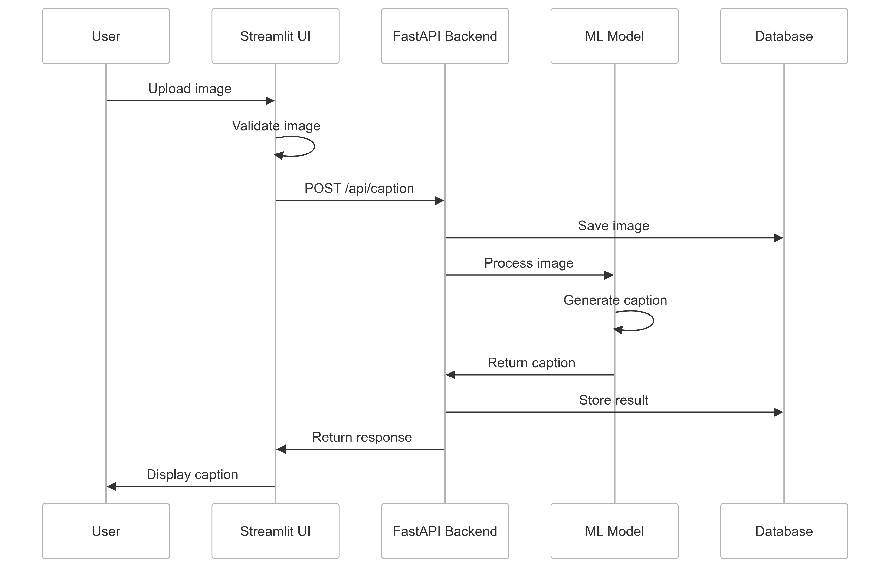

# Đề tài: Nghiên cứu sử dụng trí tuệ nhân tạo tự động mô tả hình ảnh

## 1. Mục tiêu thực hiện
- [ ] Nghiên cứu và phát triển hệ thống tự động tạo chú thích cho ảnh dựa trên các mô hình học sâu.

## 2. Phương pháp tiếp cận
- [ ] Sử dụng mô hình học sâu kết hợp giữa xử lý ảnh và ngôn ngữ tự nhiên để tạo chú thích.

## 3. Những công việc cần thực hiện

### 3.1. Nghiên cứu về Image Captioning
   - **Mục tiêu:** Tự động tạo chú thích cho ảnh.
   - **Các bước thực hiện:**
     - [ ] Nghiên cứu CNN để trích xuất đặc trưng từ ảnh bằng các mô hình CNN như ResNet, EfficientNet.
     - [ ] Tìm hiểu mô hình Attention và Transformer (Vision Transformer - ViT, CNN + LSTM).
     - [ ] Xác định bộ dữ liệu huấn luyện: MS COCO, Flickr8k, Flickr30k.
     - [ ] Áp dụng Transfer Learning từ các mô hình đã huấn luyện trước để cải thiện hiệu suất.

### 3.2. Phát triển ứng dụng sử dụng Python với FastAPI và Streamlit
   - **Mục tiêu:** Xây dựng giao diện trực quan cho người dùng.
   - **Các bước thực hiện:**
     - [ ] Xây dựng API với FastAPI.
     - [ ] Phát triển giao diện người dùng với Streamlit, cho phép tải ảnh, nhập mô tả và hiển thị kết quả.
     - [ ] Tích hợp mô hình sinh caption và tìm kiếm ảnh vào ứng dụng.

## 4. Kế hoạch thực hiện và đánh giá
- **Phân công công việc:** 
  - [ ] Xác định các đầu việc và người phụ trách cho từng hạng mục.
- **Đánh giá kết quả:** 
  - [ ] Định kỳ kiểm tra và hiệu chỉnh mô hình để đạt kết quả mong muốn.
- **Triển khai và bảo trì:** 
  - [ ] Đảm bảo ứng dụng hoạt động ổn định và sẵn sàng nâng cấp khi cần thiết.

